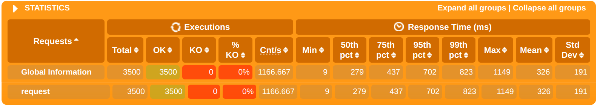

# aw10-final: MicroPos Reactive

## 如何构建

1. 启动RabbitMq、MongoDB，无配置的情况下使用默认端口，MongoDB无密码，RabbitMQ用户与密码均为`root`，如更改端口或认证则需要在子项目`application.yml`内指定
2. 运行`mvn compile`生成代码
3. 运行`batch`加载数据（需提前准备Amazon Data存放在资源文件夹的`data`子文件夹下）
3. 运行除了`batch, frontend`以外的各项SpringBoot服务。
4. （可选）在`frontend`目录下运行`yarn dev`即可在`3000`端口开启前端界面。默认使用代理服务器。
5. （可选）在开启全部服务的前提下构建并运行`testing`下的`sbt`项目，即可得到`Gatling`压力测试报告。

## 功能说明

### Batch

基于`spring-batch`对Amazon数据集进行处理，并将其转换为合适的`Product`对象存入MongoDB中，作为商城的数据来源。

### Product

响应式的获取产品信息。

```
/products:
    get?[page=1][size=20]: 分页获取产品信息
/products/{productId}:
    get: 获取特定商品信息
```

### Cart

负责购物车的存储和处理。支持若干个不同的购物车，以供不同的用户单独使用。

```
/cart/new:
    get: 创建一个新的购物车
/cart/{cartId}:
    get: 获取当前购物车的情况
    delete: 清空购物车
/cart/{cartId}/{productId}:
    get: 获取当前购物车内某产品的数量
    post{quantity=1}: 添加某产品到购车内
    put{quantity}: 编辑购物车内某产品的数量
    delete{quantity}: 从购物车内移除某产品
/cart/{cartId}/checkout:
    get: 获取当前购物车内各产品价格和总价
```

Cart服务本身并不掌握`Product`具体的结构，而是使用`ProductId`代指。在调用`checkout`功能时，在内部使用`WebFlux`与`Product`服务相连接以获取产品的价格。

### Order

负责订单的存储和处理。提交订单时，需要提供若干个`Product`以及相应的数量。

```
/order:
    get: 获取全部订单
    post[items]: 提交订单
/order/{orderId}:
    get: 获取某个订单的详情
    put?status: 编辑某个订单
    delete: 删除某个订单
```

### Delivery

Delivery服务与其他服务间相互独立。其与`Orders`间通过`RabbitMQ`消息通道进行通信，当订单新建时Order服务会通知Delivery服务并开始配送。
配送后，订单状态发生变化，此时Delivery服务会通知Order服务进行更新。
从外部访问时，Gateway提供了`HttpOut/InBound`通道转发服务。

```
/delivery/{deliveryId}:
    get: 获取某个配送的详情
```

### Testing

对响应式服务进行`Gatling`测试。详细的性能测试在后续会给出。

### Frontend

一个基于`React`的简单前端界面。

## 性能测试

### 测试环境

+ System: OpenSUSE Tumbleweed
+ CPU: AMD Ryzen 7 4800H
+ Memory: 16GB

### 性能分析

过去几次实验的经验和分析可知，系统的主要瓶颈在于`Product`服务，这主要是数据库内因为具有大量的数据必须处理。我们该服务进行了改进：

1. 使用MongoDB代替传统的关系性数据库，提升查询的性能
2. 对`allProducts`方法添加分页，并限制一次查询的最大数量，每一次访问请求不必重复查询整个数据库，而是只查询部分数据
3. 对Product服务添加缓存服务。

此外，改进前的Cart服务并不具备多用户使用的能力，导致单一购物车在高并发的情况下出现卡顿。在使Cart支持多用户后即可解决这个问题。

### Gatling脚本

我们使用`Gatling`进行性能测试。根据用户的常规操作，我们设计的操作流程如下：

1. 访问`/api/products`，获取产品列表
2. 访问`/api/cart/new`，新建一个购物车，获取购物车ID为`cartId`
3. 访问`/api/cart/{cartId}/{productId}`，添加产品到购物车
4. 访问`/api/cart/{cartId}/checkout`，获取购物车内产品价格和总价
5. 访问`/api/cart/order`，新建订单
6. 访问`/api/cart/order`，再次购买
7. 访问`/api/cart/order`，查看所有订单

> 不直接访问`Delivery`服务：Order响应中本就包括了Delivery服务的调用，因此不需要再次访问Delivery服务。

```scala
val scn: ScenarioBuilder = scenario("MicroPos Reactive")
.exec(http("request").get("/api/products"))
.exec(
  http("request")
    .get("/api/cart/new")
    .check(jsonPath("$.cartId").saveAs("cartId"))
)
.exec(http("request").post(s"/api/cart/#{cartId}/0077595696"))
.exec(http("request").get(s"/api/cart/#{cartId}/checkout"))
.exec(
  http("request")
    .post("/api/order")
    .body(StringBody("""[{"productId":"0077595696","quantity":4}]"""))
    .asJson
)
.exec(
  http("request")
    .post("/api/order")
    .body(StringBody("""[{"productId":"0077595696","quantity":12}]"""))
    .asJson
)
.exec(http("request").get("/api/order"))
```

并发数设置为500，进行测试：


可见全部请求均成功完成。进一步查看时间分布：

可见大多数请求均能在`t < 800ms`内完成，说明响应式系统具有较高的可用度和性能。

## 响应式系统

### 即时响应性（Responsive）

系统对于请求以及错误的即时处理，要求系统快速响应用户的请求。本系统使用Spring Reactive以满足即时响应需求。

### 恢复性（Resilient）

可恢复性是指系统在遇到失败或者错误时仍然能够对外提供服务。当请求出现错误时，Spring框架对外提供了一定的错误处理功能。

### 弹性（Elastic）

弹性指系统的扩展能力。本系统使用Eureka服务发现，可以让系统自动发现新的服务，并自动加载，这大大降低了系统的扩展难度。

### 消息驱动（Message Driven）

系统之间使用RabbitMQ消息队列进行通信，实现多个系统间的消息驱动。
